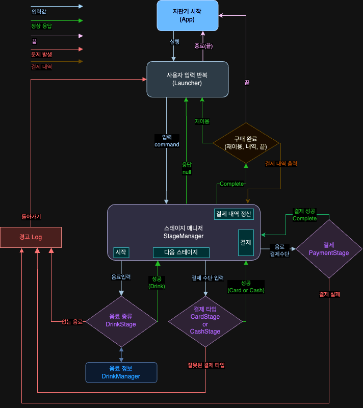
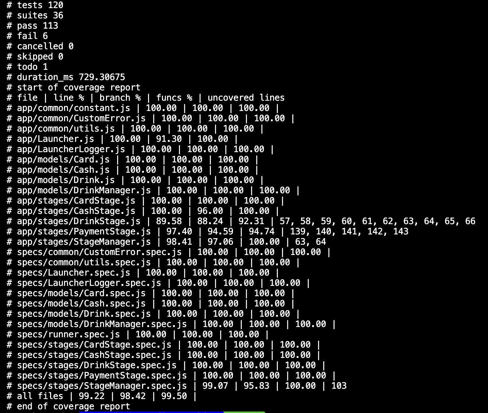

## 🥫 순수 자바스크립트 자판기

### 🏃 자판기 실행

```bash
node ./app/App
```


### 🌊 흐름도



### 📁 폴더 구조

🟢 - 테스트 코드 작성<br />
🔴 - 테스트 코드 미작성<br />
❌ - 테스트 X

```bash
.
├── README.md
├── app
│   ├── App.js ❌
│   ├── Launcher.js 🟢
│   ├── LauncherLogger.js 🟢
│   ├── common
│   │   ├── CustomError.js 🟢
│   │   ├── constant.js ❌
│   │   └── utils.js 🟢
│   ├── models
│   │   ├── Card.js 🟢
│   │   ├── Cash.js 🟢
│   │   ├── Drink.js 🟢
│   │   └── DrinkManager.js 🟢
│   └── stages
│       ├── CardStage.js 🟢
│       ├── CashStage.js 🟢
│       ├── DrinkStage.js 🟢
│       ├── PaymentStage.js 🟢
│       └── StageManager.js 🟢
└── specs (테스트)
    ├── Launcher.spec.js
    ├── LauncherLogger.spec.js
    ├── common
    │   ├── CustomError.spec.js
    │   └── utils.spec.js
    ├── models
    │   ├── Card.spec.js
    │   ├── Cash.spec.js
    │   ├── Drink.spec.js
    │   └── DrinkManager.spec.js
    └── runner.spec.js
```

### 📊 테스트

**전체 테스트 실행**

```bash
node --experimental-test-coverage ./specs/runner.spec
```

**런쳐 테스트 실행**

```bash
node --experimental-test-coverage ./specs/Launcher.spec
node --experimental-test-coverage ./specs/LauncherLogger.spec
```

**공용 테스트 실행 (common)**

```bash
node --experimental-test-coverage ./specs/common/CustomError.spec
node --experimental-test-coverage ./specs/common/utils.spec
```

**모델 테스트 실행 (models)**

```bash
node --experimental-test-coverage ./specs/models/Card.spec
node --experimental-test-coverage ./specs/models/Cash.spec
node --experimental-test-coverage ./specs/models/Drink.spec
node --experimental-test-coverage ./specs/models/DrinkManager.spec
```

**스테이지 테스트 실행 (stages)**

```bash
node --experimental-test-coverage ./specs/stages/CardStage.spec
node --experimental-test-coverage ./specs/stages/CashStage.spec
node --experimental-test-coverage ./specs/stages/DrinkStage.spec
node --experimental-test-coverage ./specs/stages/PaymentStage.spec
node --experimental-test-coverage ./specs/stages/StageManager.spec
```


